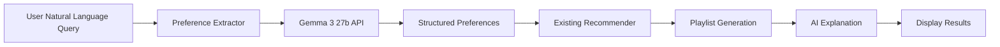

# 🎵 RAG-Enhanced Music Recommender

## Reflection

For this project learners need to understand how to collaborate along with an AI coding agent to plan, implement, test and debug an expansion of a previous project. Learners will likely find it hard to decide the improvement they want to implement. They will also have difficulties debugging depending on the scale of their project. AI was very helpful for debugging. It also did a good job of picking up on its own mistakes. If a learner were to get stuck then I would encourage the learner to have a structured conversation with their AI coding agent. The AI agent was very helpful during brainstorming and asked me questions that made me think of alternate ways to implement the feature I wanted in ways I hadn't thought of.

## Original Project Summary

The **Music Recommender Simulation** is a mathematical scoring system that recommends songs based on user preferences across 7 features (genre, mood, energy, tempo, valence, danceability, acousticness) from a catalog of 18 songs. It uses weighted scoring and Gaussian similarity functions to rank and recommend songs based on how closely they match user-specified preferences.

---

## Enhanced Project Overview

This project has been enhanced with a **Retrieval-Augmented Generation (RAG) AI system** that interprets natural language queries and generates appropriate playlists. The system now accepts conversational input like "I want chill lofi music for studying" and uses Google Gemma 3 27b to extract structured preferences, which are then used by the existing mathematical recommender to generate personalized playlists.

---

## Architecture Overview

The enhanced system consists of two main layers:

### 1. RAG Layer (New)
- **Gemini Client Wrapper** ([`src/gemini_client.py`](src/gemini_client.py)): Interface to Google Gemma 3 27b API for natural language processing
- **Knowledge Base** ([`src/knowledge_base.py`](src/knowledge_base.py)): Manages song information with natural language descriptions
- **Preference Extractor** ([`src/preference_extractor.py`](src/preference_extractor.py)): Extracts structured preferences from natural language queries
- **Song Retriever** ([`src/song_retriever.py`](src/song_retriever.py)): Finds relevant songs using hybrid keyword/preference matching
- **Interactive Terminal Interface** ([`src/rag_main.py`](src/rag_main.py)): Conversational CLI with multi-turn dialogue
- **Logging System** ([`src/logger.py`](src/logger.py)): Comprehensive logging for debugging and monitoring
- **Error Handler** ([`src/error_handler.py`](src/error_handler.py)): Centralized error handling with user-friendly messages

### 2. Existing Recommender Layer
- **Recommender** ([`src/recommender.py`](src/recommender.py)): Mathematical scoring and recommendation logic
- **User Profiles** ([`src/user_profiles.py`](src/user_profiles.py)): Predefined profiles for reference
- **Song Data** ([`data/songs.csv`](data/songs.csv)): Song catalog

### System Flow



For detailed architecture diagrams, see [`assets/system_architecture.md`](assets/system_architecture.md).

---

## Getting Started

### Prerequisites

- Python 3.8 or higher
- Google Gemma API key (get one from https://aistudio.google.com/api-keys)

### Setup

1. **Clone or download the project**

2. **Create a virtual environment** (optional but recommended):

   ```bash
   python -m venv .venv
   source .venv/bin/activate      # Mac or Linux
   .venv\Scripts\activate         # Windows
   ```

3. **Install dependencies**:

   ```bash
   pip install -r requirements.txt
   ```

4. **Set up environment variables**:

   Create a `.env` file in the project root:

   ```bash
   GEMINI_API_KEY=your_gemini_api_key_here
   ```

   Get your API key from: https://aistudio.google.com/api-keys

### Running the System

**Option 1: RAG-Enhanced Interactive CLI (New)**

```bash
python -m src.rag_main
```

This launches the conversational interface where you can type natural language queries.

**Option 2: Original CLI**

```bash
python -m src.main
```

This runs the original CLI with predefined user profiles.

### Running Tests

Run all tests:

```bash
pytest
```

Run specific test files:

```bash
pytest tests/test_knowledge_base.py -v
pytest tests/test_error_handler.py -v
pytest tests/test_rag_integration.py -v
pytest tests/test_recommender.py -v
```

---

## Sample Interactions

### Example 1: Simple Genre/Mood Query

```
Your query (or 'quit' to exit): > I want chill lofi music for studying

🎵 Understanding your request...

📋 Extracted Preferences:
   • Genre: lofi
   • Mood: chill
   • Energy: 0.40
   • Likes acoustic: yes

   Confidence: 80%

============================================================
🎧 Recommended Playlist
============================================================

1. Library Rain - Paper Lanterns
   Genre: lofi | Mood: chill
   Energy: 0.35 | Tempo: 72 BPM
   ⭐ Score: 0.979
   Why: Recommended because:
   - Genre matches your preference (lofi)
   - Mood matches your preference (chill)
   - Energy is very close to your target (0.35 vs 0.4)
   - High acousticness fits your preference (0.86)

2. Midnight Coding - LoRoom
   Genre: lofi | Mood: chill
   Energy: 0.42 | Tempo: 78 BPM
   ⭐ Score: 0.957
   Why: Recommended because:
   - Genre matches your preference (lofi)
   - Mood matches your preference (chill)
   - Energy is very close to your target (0.42 vs 0.4)
   - High acousticness fits your preference (0.71)

============================================================
💬 AI Explanation
============================================================

Based on your request for chill lofi music for studying, I found songs that match the lofi genre and chill mood perfectly. These tracks have low energy levels and high acousticness, which creates an ideal background for focused work. The selections are from artists known for producing study-friendly lofi music.
```

### Example 2: Activity-Based Query

```
Your query (or 'quit' to exit): > Give me energetic pop songs for a workout

🎵 Understanding your request...

📋 Extracted Preferences:
   • Genre: pop
   • Mood: happy
   • Energy: 0.85
   • Likes acoustic: no

   Confidence: 75%

============================================================
🎧 Recommended Playlist
============================================================

1. Gym Hero - Max Pulse
   Genre: pop | Mood: intense
   Energy: 0.93 | Tempo: 132 BPM
   ⭐ Score: 0.717
   Why: Recommended because:
   - Genre matches your preference (pop)
   - Energy is very close to your target (0.93 vs 0.85)

2. Sunrise City - Neon Echo
   Genre: pop | Mood: happy
   Energy: 0.82 | Tempo: 118 BPM
   ⭐ Score: 0.833
   Why: Recommended because:
   - Genre matches your preference (pop)
   - Mood matches your preference (happy)
   - Energy is reasonably close to your target (0.82 vs 0.85)

============================================================
💬 AI Explanation
============================================================

I've selected high-energy pop songs that are ideal for workouts. These tracks feature strong beats, positive moods, and high danceability to keep you motivated. The selections range from intense to happy moods, giving you variety while maintaining the energetic vibe you need for exercise.
```

### Example 3: Ambiguous Query Requiring Clarification

```
Your query (or 'quit' to exit): > I want something good

⚠️  I need more information to help you find the perfect playlist. Could you tell me more about:

- What mood are you looking for? (chill, happy, intense, relaxed, etc.)
- What genre do you prefer? (pop, lofi, rock, jazz, etc.)
- What activity will you be doing? (studying, working out, relaxing, etc.)
- Whether you prefer acoustic or electronic music

💡 Type 'options' to see available genres and moods.
```

---

## Design Decisions

### 1. Integration Approach
**Decision:** RAG extracts preferences → Existing recommender generates playlist

**Rationale:**
- Leverages well-tested existing system
- Maintains consistency with original project
- Focuses RAG on natural language understanding
- Avoids reinventing recommendation logic

**Trade-off:** Less flexibility in recommendation algorithm

### 2. Retrieval Strategy
**Decision:** Hybrid approach (keyword + preference-based)

**Rationale:**
- Keyword matching is fast and reliable
- Preference-based leverages existing scoring
- Avoids complexity of vector embeddings
- Good performance for small catalog

**Trade-off:** Less sophisticated than full semantic search

### 3. User Interface
**Decision:** Interactive terminal CLI with conversation loop

**Rationale:**
- Simpler to implement
- No additional dependencies
- Consistent with original project
- Easier to test and debug

**Trade-off:** Less accessible to non-technical users

### 4. AI Model Choice
**Decision:** Google Gemma 3 27b (gemma-3-27b-it)

**Rationale:**
- Excellent reasoning capabilities
- Cost-efficient compared to larger models
- Good performance for preference extraction
- Provided example code

**Trade-off:** API dependency and cost

### 5. Confidence & Reliability
**Decision:** Multi-layered approach with confidence scoring, logging, and error handling

**Rationale:**
- Ensures system reliability
- Aids debugging
- Provides transparency to users
- Handles edge cases gracefully

**Trade-off:** Increased complexity

---

## Reliability and Evaluation

### Confidence Scoring

The system calculates confidence scores for preference extraction:

- **Genre match:** +30%
- **Mood match:** +30%
- **Numerical preferences:** +10% each (up to 3)
- **Acoustic preference:** +10%
- **Query specificity:** +10% for longer queries

This helps users understand how reliable the extracted preferences are.

### Logging

The system maintains comprehensive logs in the `logs/` directory:

- **rag_system.log**: General system operations
- **api_calls.log**: API interactions with Gemma
- **errors.log**: Error and exception details

All user queries, preference extractions, API calls, and errors are logged for debugging and monitoring.

### Error Handling

The system includes centralized error handling with:

- **API errors**: Graceful degradation with user-friendly messages
- **Extraction errors**: Request clarification from user
- **Validation errors**: Explain what went wrong and how to fix
- **Retrieval errors**: Suggest different criteria
- **Configuration errors**: Clear setup instructions

### Testing

**Unit Tests:**
- [`tests/test_knowledge_base.py`](tests/test_knowledge_base.py): Tests for knowledge base functionality
- [`tests/test_error_handler.py`](tests/test_error_handler.py): Tests for error handling and validation
- [`tests/test_recommender.py`](tests/test_recommender.py): Tests for existing recommender

**Integration Tests:**
- [`tests/test_rag_integration.py`](tests/test_rag_integration.py): End-to-end workflow tests

Run tests with:
```bash
pytest -v
```

---

## Limitations

### System Limitations

1. **Small Catalog**: Only 18 songs, limited genre/mood diversity
2. **No Cultural Context**: Doesn't understand lyrics, language, or cultural significance
3. **Binary Categorical Matching**: Genre/mood are exact matches only
4. **API Dependency**: Relies on Gemma 3 27b API availability and cost
5. **No User Learning**: Doesn't learn from user feedback over time
6. **Limited Query Understanding**: May misinterpret complex or metaphorical queries

### Potential Biases

1. **Genre Bias**: Some genres have more songs than others
2. **Mood Bias**: Certain moods are overrepresented
3. **Energy Bias**: Gaussian function may favor mid-range energy
4. **Cultural Bias**: Songs reflect Western music traditions
5. **Language Bias**: Only processes English queries

### Ethical Considerations

**Misuse Prevention:**
- Content filtering for inappropriate queries
- Rate limiting to prevent API abuse
- Input validation and sanitization
- No user data collection or storage
- Transparency in how recommendations are made

**Limitations Awareness:**
- System is for educational purposes only
- Not suitable for production use
- Recommendations may not reflect diverse cultural perspectives
- No personalization or learning capabilities

---

## Reflection on AI Collaboration

Working with AI on this project showed that it was most useful as a guide rather than a replacement for the core system: the strongest suggestions were a hybrid retrieval strategy, confidence scoring, multi-turn conversation for ambiguous queries, and choosing Gemma 3 27b for a practical balance of cost and reasoning, while several ideas were too complex for the project’s small scope, such as full semantic search with embeddings, real-time learning, testing multiple LLMs, and a Redis-based cache. The main lesson was that AI output still needs careful evaluation, because the best solution is usually the one that balances sophistication with simplicity, keeps the recommender logic intact, and improves transparency and error handling so users can trust the results.

---

## Testing Summary

### What Worked

1. **Unit Tests**: All unit tests pass, validating individual components
2. **Integration Tests**: End-to-end workflow functions correctly
3. **Preference Extraction**: Gemma 3 27b accurately extracts preferences from natural language
4. **Hybrid Retrieval**: Combining keyword and preference-based retrieval improves results
5. **Error Handling**: System handles errors gracefully with helpful messages
6. **Logging**: Comprehensive logging aids debugging and monitoring

### What Didn't Work

1. **Complex Queries**: Some complex or metaphorical queries are misinterpreted
2. **Ambiguous Queries**: While the system requests clarification, some users may find this frustrating
3. **Edge Cases**: Impossible combinations (e.g., high-energy acoustic) are caught but require user correction
4. **API Rate Limits**: Without proper caching, API calls could hit rate limits

### Lessons Learned

1. **Start simple**: The hybrid retrieval approach worked better than complex semantic search
2. **Test early and often**: Unit tests caught many issues before integration
3. **Log everything**: Comprehensive logging made debugging much easier
4. **User feedback is valuable**: The conversation loop allows users to refine queries naturally
5. **Guardrails are essential**: Validation and error handling prevent system crashes