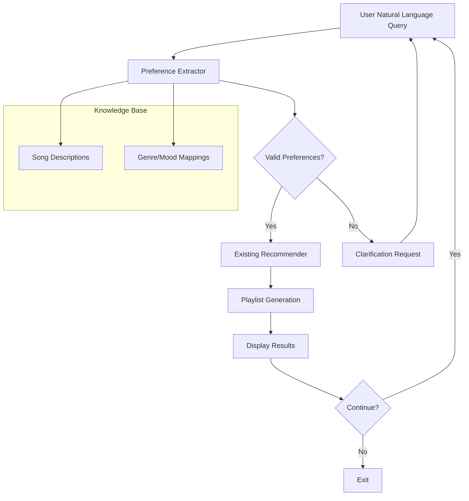
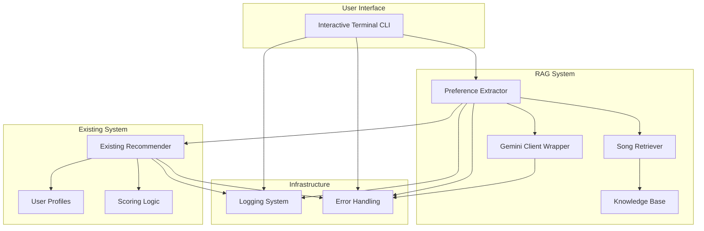
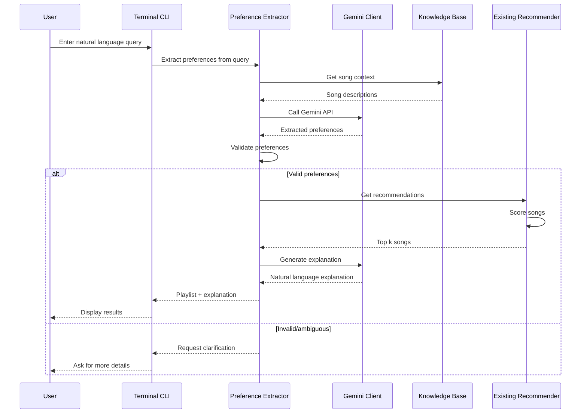
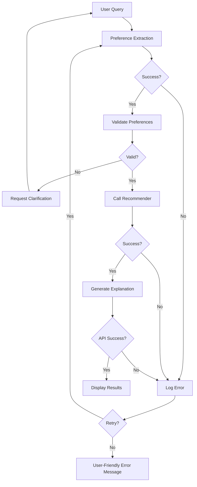
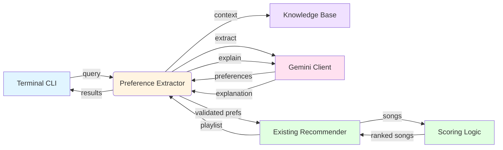

# System Architecture Diagrams

## High-Level System Flow

```mermaid
flowchart TD
    A[User Natural Language Query] --> B[Preference Extractor]
    B --> C{Valid Preferences?}
    C -->|Yes| D[Existing Recommender]
    C -->|No| E[Clarification Request]
    E --> A
    D --> F[Playlist Generation]
    F --> G[Display Results]
    G --> H{Continue?}
    H -->|Yes| A
    H -->|No| I[Exit]
    
    subgraph Knowledge Base
        J[Song Descriptions]
        K[Genre/Mood Mappings]
    end
    
    B --> J
    B --> K
```

## Component Architecture

```mermaid
flowchart TB
    subgraph User Interface
        UI[Interactive Terminal CLI]
    end
    
    subgraph RAG System
        GC[Gemini Client Wrapper]
        PE[Preference Extractor]
        RET[Song Retriever]
        KB[Knowledge Base]
    end
    
    subgraph Existing System
        ER[Existing Recommender]
        UP[User Profiles]
        SC[Scoring Logic]
    end
    
    subgraph Infrastructure
        LOG[Logging System]
        ERR[Error Handling]
    end
    
    UI --> PE
    PE --> GC
    PE --> RET
    RET --> KB
    PE --> ER
    ER --> UP
    ER --> SC
    
    UI --> LOG
    PE --> LOG
    ER --> LOG
    
    UI --> ERR
    PE --> ERR
    ER --> ERR
    GC --> ERR
```

## Data Flow

```mermaid
sequenceDiagram
    participant U as User
    participant UI as Terminal CLI
    participant PE as Preference Extractor
    participant GC as Gemini Client
    participant KB as Knowledge Base
    participant ER as Existing Recommender
    
    U->>UI: Enter natural language query
    UI->>PE: Extract preferences from query
    PE->>KB: Get song context
    KB-->>PE: Song descriptions
    PE->>GC: Call Gemini API
    GC-->>PE: Extracted preferences
    PE->>PE: Validate preferences
    alt Valid preferences
        PE->>ER: Get recommendations
        ER->>ER: Score songs
        ER-->>PE: Top k songs
        PE->>GC: Generate explanation
        GC-->>PE: Natural language explanation
        PE-->>UI: Playlist + explanation
        UI-->>U: Display results
    else Invalid/ambiguous
        PE-->>UI: Request clarification
        UI-->>U: Ask for more details
    end
```

## Error Handling Flow

```mermaid
flowchart TD
    A[User Query] --> B[Preference Extraction]
    B --> C{Success?}
    C -->|No| D[Log Error]
    D --> E{Retry?}
    E -->|Yes| B
    E -->|No| F[User-Friendly Error Message]
    C -->|Yes| G[Validate Preferences]
    G --> H{Valid?}
    H -->|No| I[Request Clarification]
    I --> A
    H -->|Yes| J[Call Recommender]
    J --> K{Success?}
    K -->|No| D
    K -->|Yes| L[Generate Explanation]
    L --> M{API Success?}
    M -->|No| D
    M -->|Yes| N[Display Results]
```

## Component Interactions

```mermaid
graph LR
    A[Terminal CLI] -->|query| B(Preference Extractor)
    B -->|context| C[Knowledge Base]
    B -->|extract| D[Gemini Client]
    D -->|preferences| B
    B -->|validated prefs| E[Existing Recommender]
    E -->|songs| F[Scoring Logic]
    F -->|ranked songs| E
    E -->|playlist| B
    B -->|explain| D
    D -->|explanation| B
    B -->|results| A
    
    style A fill:#e1f5ff
    style B fill:#fff4e1
    style C fill:#f0e1ff
    style D fill:#ffe1f0
    style E fill:#e1ffe1
    style F fill:#e1ffe1
```
